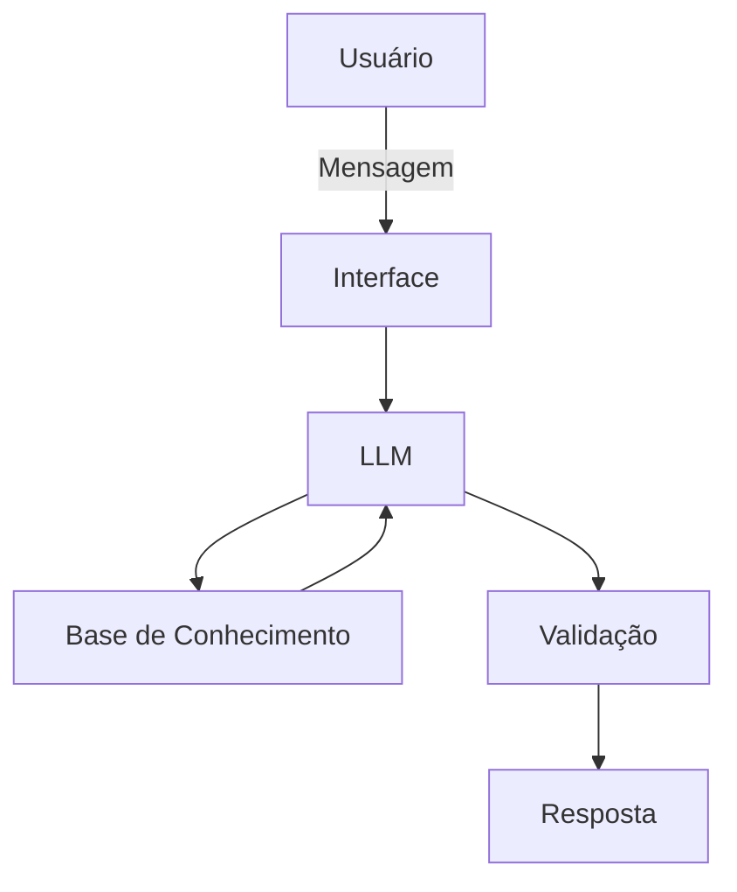

# Documentação do Agente

## Caso de Uso

### Problema
> Qual problema financeiro seu agente resolve?

Muitas pessoas não sabem qual caminho profissional seguir e não têm acesso a orientação de carreira personalizada, clara e acessível.

### Solução
> Como o agente resolve esse problema de forma proativa?

O agente atua de forma proativa conduzindo o usuário por um diagnóstico guiado, adaptando perguntas, antecipando dúvidas e oferecendo planos de ação personalizados, acompanhando a evolução ao longo do tempo.

### Público-Alvo
> Quem vai usar esse agente?

Estudantes (ensino médio / técnico)

Pessoas em transição de carreira

Profissionais iniciantes

Quem está desempregado

---

## Persona e Tom de Voz

### Nome do Agente
Orienta

### Personalidade
> Como o agente se comporta? (ex: consultivo, direto, educativo)

Empático

Orientador

Analítico

Comunicativo

Ético

### Tom de Comunicação
> Formal, informal, técnico, acessível?

Acessível , pois Atende pessoas de diferentes níveis de escolaridade,
facilita o entendimento de quem está confuso ou inseguro,
Reduz barreiras de linguagem,
mantém o agente próximo, humano e confiável.

### Exemplos de Linguagem
- Saudação: "Olá! Eu sou o Orienta Como posso ajudar hoje?"
- Confirmação: "Entendi! Deixa eu verificar isso para você."
- Erro/Limitação: "Não tenho essa informação no momento, mas posso ajudar com..."

---

## Arquitetura

### Diagrama

### Componentes

| Componente | Descrição |
|------------|-----------|
| Interface | [Streamlit](https://streamlit.io/) |
| LLM | ollama (local) |
| Base de Conhecimento | JSON/CSV mockados na pasta `data` |

---

## Segurança e Anti-Alucinação

### Estratégias Adotadas

- [x] Conversa Guiada por Etapas
- [x] Diagnóstico Progressivo
- [x] Mapeamento de Perfil Profissional
- [x] Recomendações Contextualizadas
- [x] Plano de Ação Orientado a Passos
- [x] Adaptação ao Ritmo do Usuário
- [x] Reforço Positivo e Clareza
- [x] Registro e Continuidade

### Limitações Declaradas
> O que o agente NÃO faz?

- O agente não escolhe a carreira
- Não substitui um orientador humano
- Não coleta dados sensíveis 
- Não atua fora do escopo de carreira
- Não força escolhas ou caminhos
- Não fornece aconselhamento legal ou financeiro
- Não faz diagnósticos psicológicos
